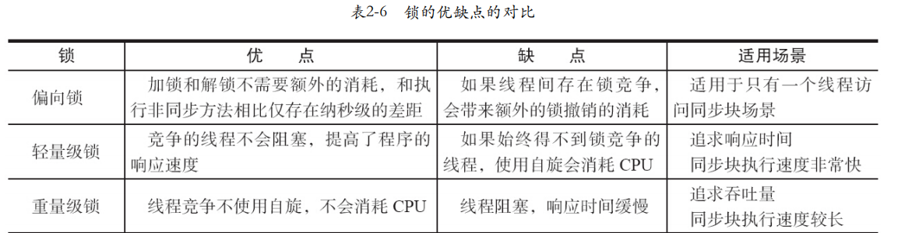

------

### 1 并发编程的挑战

#### 1.1多线程一定快么？

在上下文切换耗费的时间与多线程运行节省的时间两者的抗衡中，取一个最佳的状态，这个要具体分析。

#### 1.2如何减少上下文的切换？

减少上下文切换的方法有无锁并发编程、CAS算法、使用最少线程和使用协程。
无锁并发编程:多线程竞争锁时,会引起上下文切换,所以多线程处理数据时,可以用一些办法来避免使用锁,如将数据的ID按照Hash算法取模分段,不同的线程处理不同段的数据
CAS算法:Java的Atomic包使用CAS算法来更新数据,而不需要加锁。
使用最少线程:避免创建不需要的线程,比如任务很少,但是创建了很多线程来处理,这样会造成大量线程都处于等待状态。
协程:在单线程里实现多任务的调度,并在单线程里维持多个任务间的切换。

#### 1.3避免死锁的常见方法？

避免一个线程同时获取多个锁。
避免一个线程在锁内同时占用多个资源,尽量保证每个锁只占用一个资源。
尝试使用定时锁,使用lock.tryLock (timeout)来替代使用内部锁机制。
对于数据库锁,加锁和解锁必须在一个数据库连接里,否则会出现解锁失败的情况。

### 2Java并发机制的底层实现原理

#### 2.1volatile关键字的两条实现原则？

1) **Lock前缀指令会引起处理器缓存回写到内存**。Lock前缀指令导致在执行指令期间,声言处理器的LOCK#信号。在多处理器环境中, LOCK#信号确保在声言该信号期间,处理器可以独占任何共享内存。但是,在最近的处理器里, LOCK #信号一般不锁总线,而是锁缓存,毕竟锁总线开销的比较大。在8.1.4节有详细说明锁定操作对处理器缓存的影响,对于 Intel486和Pentium处理器,在锁操作时,总是在总线上声言LOCK#信号。但在P6和目前的处理器中,如果访问的内存区域已经缓存在处理器内部,则不会声言LOCK#信号。相反,它会锁定这块内存区域的缓存并回写到内存,并使用缓存一致性机制来确保修改的原子性,此操作被称为“缓存锁定”,缓存一致性机制会阻止同时修改由两个以上处理器缓存的内存区域数据。
2)**一个处理器的缓存回写到内存会导致其他处理器的缓存无效**。IA-32处理器和Intel 64处理器使用MESI (修改、独占、共享、无效)控制协议去维护内部缓存和其他处理器缓存的一致性。在多核处理器系统中进行操作的时候, IA-32和 Intel 64处理器能嗅探其他处理器访问系统内存和它们的内部缓存。处理器使用嗅探技术保证它的内部缓存、系统内存和其他处理器的缓存的数据在总线上保持一致。例如,在Pentium和P6 family处理器中,如果通过嗅探一个处理器来检测其他处理器打算写内存地址,而这个地址当前处于共享状态,那么正在嗅探的处理器将使它的缓存行无效,在下次访问相同内存地址时,强制执行缓存行填充。

#### 2.2synchronized锁对象的几种情况

 Java中的每一个对象都可以作为锁。具体表现为以下3种形式。
1）对于普通同步方法,锁是当前实例对象。
2）对于静态同步方法,锁是当前类的Class对象。
3）对于同步方法块，锁是synchronized括号里配置的对象

说明，JVM通过获取monitor(监视器)对对象进行加锁，synchronized对于同步方法块来说，通过调用monitorenter和monitorexit显式的加锁，但是对于普通同步方法，锁的是this实例对象，静态的同步方法则是锁住Class对象，在方法调用的时候会检查方法的ACC_SYNCHRONIZED访问标志是否被设置了，如果被设置了，表明是一个同步方法，这个时候，执行线程将会先持有monitor对象(尝试持有，可能没有持有成功)，然后再访问执行方法，最后再方法完成的时候，无论是正常完成还是出现异常都会释放monitor。在方法执行期间其他任何一个线程都不能获得同一个monitor对象。

性能的执行效率：
同步方法体 < 同步代码块 < 小对象锁同步代码块

#### 2.3偏向锁

因为偏向锁的撤销消耗较大，偏向锁不适合竞争激烈的情况
默认启用偏向锁，但是是延迟开启，关闭延迟的参数 -XX：BiasedLockingStartupDelay=0
关闭偏向锁 -XX:UseBiasedLocking=false,默认进入轻量级锁

#### 2.4轻量级锁的竞争

(1)轻量级锁加锁线程在执行同步块之前, JVM会先在当前线程的栈桢中创建用于存储锁记录的空间,并将对象头中的Mark Word复制到锁记录中,官方称为Displaced Mark Word,然后线程尝试使用CAS将对象头中的Mark Word替换为指向锁记录的指针。如果成功,当前线程获得锁,如果失败,表示其他线程竞争锁,当前线程便尝试使用自旋来获取锁。
(2)轻量级锁解锁轻量级解锁时,会使用原子的CAS操作将Displaced Mark Word替换回到对象头,如果成功,则表示没有竞争发生。如果失败,表示当前锁存在竞争,锁就会膨胀成重量级锁。

